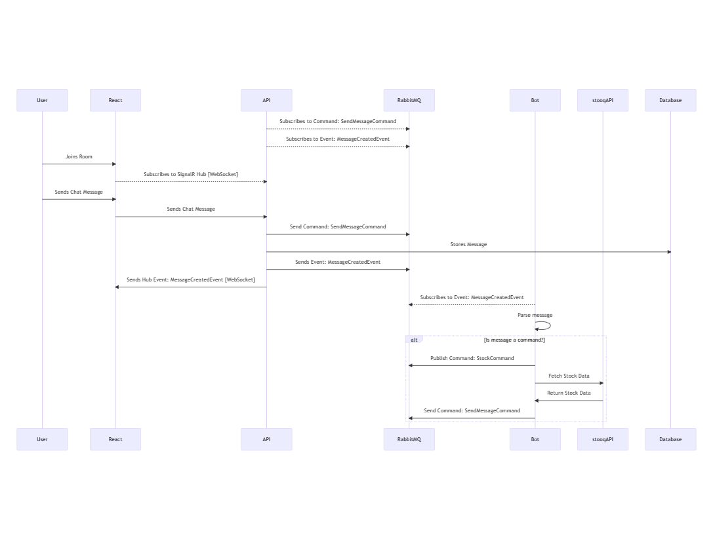
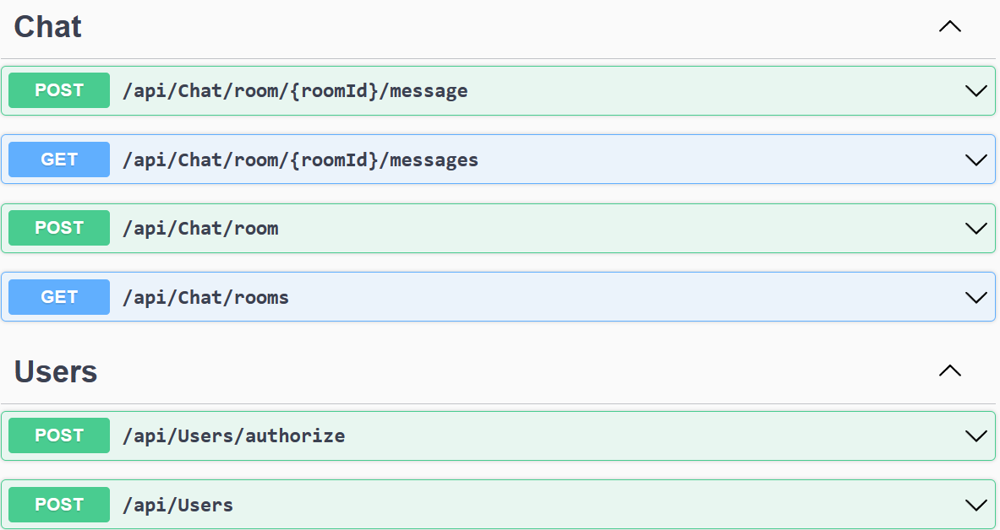

# Chat Application
A simple browser-based chat application using .NET.
Should allow several users to talk in a chatroom and also to get stock quotes from an API using a specific command.

Disclaimer:
>The naming of this Git repository, 'Janis', is inspired by the character of the same name from the TV show 'Friends'. The choice of this name is not intended to infringe on any copyright or trademark laws, and is used solely for the purpose of providing context and a memorable name for the repository. The character's personality, actions or traits do not represent the project or its creators. The project and its creators are in no way affiliated with or endorsed by the creators or owners of the television show 'Friends'.


## Features
- Allow users to register in the application;
- Allow registered users to log in and talk with other users in a chatroom;
- Allow users to post messages as commands into the chatroom with the following format
    - Get stock code: `/{command}={parameter}` where:
        - `{command}` is a command name. Eg.: `stock`;
        - `{parameter}` is a parameter for the commmand. Eg.: `aapl.us`;

> Please, refer to [Improvements](#improvements) section

### Command: Stock
Allows users to use command `/stock` that will use `stooq.com` API to get stock data, and then post this data back to the chat room as message in the following format: 
> "`stock_code` quote is `value` per share"

The post owner will be the bot.

#### API: stooq.com
Request:
- `HTTP GET` : `https://stooq.com/q/l/?s={stock_code}&f=sd2t2ohlcv&h&e=csv`

Response:

The API result is a CSV file containing the following columns:
`Symbol`, `Date`, `Time`, `Open`, `High`, `Low`, `Close` and `Volume`.


## Architecture
The following [C4 System Context Diagram](https://c4model.com/#SystemContextDiagram) describes the persons and the systems relations:


The following [C4 System Container Diagram](https://c4model.com/#ContainerDiagram) the Chat App:


### Event Driven: Commands and Events
Event-driven architecture is a pattern for building systems where events are used to trigger actions or updates. It is based on the idea of sending a message or an event when something happens, rather than making a request and waiting for a response. This allows for more flexibility and scalability in the system, as well as better separation of concerns.

Queuing a commands and events to be processed later allows for decoupling the sender of a command from the receiver and the processing of that command. It also allows for processing to happen asynchronously, which can improve the overall performance and scalability of the system.

Furthermore, it allows for greater fault tolerance and reliability. If one worker fails to process a command, another worker can pick it up and process it, reducing the risk of a single point of failure.


Consider this sequence diagram:


- User joins a Room using React's UI
- React subscribe to SignalR Hub;
- User sends a message using React UI;
- React sends message to API;
- API publishes a command `SendMessageCommand` to RabbitMQ;
- API subscribes to get `SendMessageCommand` command;
- API execute domain logic according to command;
- API stores into Database the message;
- API sends event `MessageCreatedEvent`;
- API's SignalR Hub subscribes to event `MessageCreatedEvent`, and send message to React clients;
- Bot subscribes to event `MessageCreatedEvent`;
- Bot parses message to identify if it's command
    - If message is a command, bot publishes command according to `CommandFactory` (for now it only accepts `StockCommand`);
- Bot get `StockCommand` and call `stooq.com` API;
- Bot parses the CSV into a message and publishes a command `SendMessageCommand` to RabbitMQ;


### API Documentation
API documentation can be accessed using [Swagger](https://localhost:7073/swagger), as follows:


## Running the Application

### Docker Compose
```
cd src
docker compose up
```

Application will start at: [http://localhost:3000](http://localhost:3000).

# Improvements
- For the sake of simplicity, it's running in-memory database;
    - Setup PostgreSQL or MySQL ;
    - Setup EF migrations;
- Create docker and docker-compose files;
    - [X] Dockerfile for API
    - [X] Dockerfile for Bot
    - [X] Dockerfile for React
- Use an identity Provider (AWS Cognito, Keycloak);
    - For now, it's a ad-hoc identity provider for the sake of simplicity
- Increase code coverage of unit tests;
- Create CI/CD pipeline
    - Github Actions is a good choice;
- Observability 
    - Generate logs using Serilog;
    - Use Sink (from Serilog) or side-car container to upload logs to APM tool;
- This is mono-repo. Ideally, should segregate and make it independent;
- Use of message broker enforced loose coupled approach, but there's still dependency on `JaniceChat.MessageBroker.Abstraction` that is shared between `JaniceChat.FinBot` and `JaniceChat.Service`.
    - Consider segregating contracts shared into a new project `JaniceChat.Contracts`;
    - For every increment, publish this new project into Nuget repository (AWS Code Artifact or Nuget.Org);
- Add authorization to SignalR/Hub route;
- Create middleware for handling exceptions;
- Add `FluentValidator` to validate models;
- SignalR is running with the API, but ideally we should use AWS Event Bridge or Azure SignalR to decouple and make it more resiliente as we scale;
